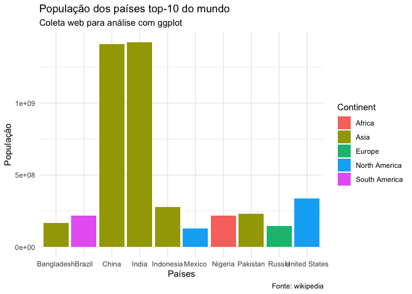

Analise Populacional
================
2024-02-19

# Importando bibliotecas

Importe a biblioteca rvest para acessar dados web do wikipedia e
processar esses dados.

``` r
library(tidyverse)
```

    ## ── Attaching core tidyverse packages ──────────────────────── tidyverse 2.0.0 ──
    ## ✔ dplyr     1.1.4     ✔ readr     2.1.5
    ## ✔ forcats   1.0.0     ✔ stringr   1.5.1
    ## ✔ ggplot2   3.4.4     ✔ tibble    3.2.1
    ## ✔ lubridate 1.9.3     ✔ tidyr     1.3.1
    ## ✔ purrr     1.0.2     
    ## ── Conflicts ────────────────────────────────────────── tidyverse_conflicts() ──
    ## ✖ dplyr::filter() masks stats::filter()
    ## ✖ dplyr::lag()    masks stats::lag()
    ## ℹ Use the conflicted package (<http://conflicted.r-lib.org/>) to force all conflicts to become errors

``` r
library(rvest)
```

    ## 
    ## Attaching package: 'rvest'
    ## 
    ## The following object is masked from 'package:readr':
    ## 
    ##     guess_encoding

``` r
library(data.table)
```

    ## 
    ## Attaching package: 'data.table'
    ## 
    ## The following objects are masked from 'package:lubridate':
    ## 
    ##     hour, isoweek, mday, minute, month, quarter, second, wday, week,
    ##     yday, year
    ## 
    ## The following objects are masked from 'package:dplyr':
    ## 
    ##     between, first, last
    ## 
    ## The following object is masked from 'package:purrr':
    ## 
    ##     transpose

``` r
library(knitr)
library(RColorBrewer)
```

# Importando os dados a partir do site da wikipedia

# Criando função auxiliar para limpar os nomes das variáveis,

- tirando os espacos e;
- Substituindo por “\_“.

# Selecionando as colunas úteis para analise e limpei as variáveis

- Limpando a variável Population para se tornar uma variável numérica
- Limpando a variável Percentage_of_the_world and convertendo para
  proporções na classe numeric
- Limpando a variável Date e convertendo de character para classe Date

# Vamos criar uma variável continente ?

- Importando uma base de dados que tenha a informacao de paises por
  continente
- Vinculando esta base à nossa base limpa com os dados de populacao por
  pais no top-10

# Vamos agrupar os dados de populacao por continente e criar uma nova variavel ?

``` r
pop.mundial <- pop.mundial %>% dplyr::group_by(Continent) %>% dplyr::mutate(Population_Continent = sum(Population))
pop.mundial.agg <- pop.mundial %>% dplyr::group_by(Continent) %>% dplyr::summarise(Population_Continent = sum(Population))
kable(pop.mundial.agg)
```

| Continent     | Population_Continent |
|:--------------|---------------------:|
| Africa        |            216746934 |
| Asia          |           3514781044 |
| Europe        |            147190000 |
| North America |            464392938 |
| South America |            217324191 |

# Vamos construir alguns uns plots?

``` r
ggplot(pop.mundial %>% dplyr::select(Country_Dependency, Population, Continent), aes(x = Country_Dependency, y = Population, fill = Continent)) + geom_bar(stat = "identity") + xlab("Países") + ylab("População") + labs(title = "População dos países top-10 do mundo", subtitle = "Coleta web para análise com ggplot", caption = "Fonte: wikipedia") + theme_minimal()
```

<!-- -->

# Quantos países temos por continente?

``` r
ggplot(pop.mundial, aes(y = Continent)) + geom_bar(stat = "count") + coord_flip()
```

<!-- -->

# Será que temos algum continente que apresenta maior intervalor interquartial entre as populações no top-10?

``` r
ggplot(pop.mundial, aes(x = Continent, y = Population)) + geom_boxplot()
```

<!-- -->

# Podemos mudar a escala

``` r
ggplot(pop.mundial, aes(x = Continent, y = Population)) + geom_boxplot() + scale_y_continuous(trans='log10')
```

<!-- -->

# Como se distribuem os dados por continente?

``` r
ggplot(pop.mundial, aes(x = Continent, y = Population)) + geom_violin()
```

    ## Warning: Groups with fewer than two data points have been dropped.
    ## Groups with fewer than two data points have been dropped.
    ## Groups with fewer than two data points have been dropped.

<!-- -->

# Se quisermos colorir os boxplot por continente?

## Vamos definir uma paleta?

``` r
pal <- pop.mundial %>% dplyr::select(Continent) %>% unique(.) %>% nrow(.) %>% brewer.pal(., name = "Accent")
#pal <- brewer.pal(length(unique(pop.mundial$Continent)), name = "Accent")
pal.custom <- c("#7B6B4C", "#4C507B", "#7B4C6D", "#7B4C4C", "#4C7B77")
```

## Vamos aos plotes

# Com a paleta do RcolorBrewer

``` r
p1 <- ggplot(pop.mundial, aes(x = Continent, y = Population, fill = Continent)) + geom_boxplot() + scale_fill_manual(values = pal)
```

# Com a paleta customizada

``` r
p2 <- ggplot(pop.mundial, aes(x = Continent, y = Population, fill = Continent)) + geom_boxplot() + scale_fill_manual(values = pal.custom)
```

``` r
ggplot(pop.mundial, aes(x = Date, y = Population, color = Continent)) + geom_point()
```

<!-- -->
